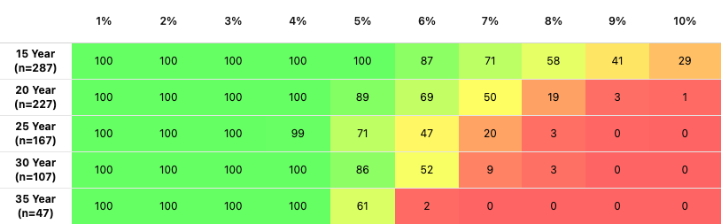

# 日本版トリニティ・スタディ

## プロジェクト概要

MSCI ACWI を日本円建てで取崩すシミュレーションを掲載するサイト「日本版トリニティスタディ」のソースコード。

毎月最新データを自動的に取得し、シミュレーション結果を更新する。

[シミュレーション結果はこちら](https://trinity-study.kanaru.jp)

## 公開 URL

[trinity-study.kanaru.jp](https://trinity-study.kanaru.jp)

## 技術スタック

- [Next.js v16](https://nextjs.org/)
- [TypeScript v5](https://www.typescriptlang.org/)
- [GitHub](https://github.com/) (Actions and Pages)

## 必要要件

- Node.js v24.x（LTS）
- npm v10 以上

## データ入手元

ACWI のチャートデータ : [End of day index data search](https://www.msci.com/end-of-day-data-search)

ドル円為替データ : [exchangerates API](https://exchangeratesapi.io/)

## 環境変数

- `NEXT_PUBLIC_BASE_URL`: OGP やリンク生成に使用するサイトのベース URL。
- `NEXT_PUBLIC_GTM_ID`: Google Tag Manager のコンテナ ID（例: `GTM-XXXXXXX`）。
- `EXCHANGE_RATE_API_KEY`: exchangerates API の認証キー。
